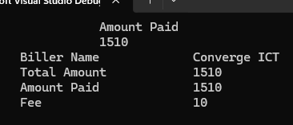

# C# Programming

> Java and C# are fundamentally the same

## Type of .Net Apps

- Console App
- Windows Form
- Windows Presentation
- ASP.NET Web Forms
- ASP.NET MVC
- ASP.NET .NET Core
- WCF
- Windows Service
- Xamarin App
- UWP

## What is Programming?
>
> Refers to technological process for telling computer which task to perform in order to solve problems.
>
> Write Code
>> Compile
>>>Execute
>>>>Perform task
>>>>>Output

Structure:

>- One namespace can contain multiple classes
>- One Classes can contain multiple methods

```c#
internal class Program
{
    private static void Main(string[] args)
    {
        /*
        This is a multiple comment
        */
        //this is a single comment
        Console.WriteLine("Print Me");

    }
}
```

Data Types

- int - Integer
- double - Decimal
- float - Floating value
- char - Single Char
- String - multiple character
- bool - two states, true or false

```c#
internal class Program
{
    private static void Main(string[] args)
    {
        
        String firstName = "Raymart";
        int age = 25;
        double height = 5.7;
        bool isStudent = true;
        char a = 'A';

    }
}
```

```c#
//bill
internal class Program
{
    private static void Main(string[] args)
    {
        string column = "{0,-10} {1,-10} {2,-10} {3,-10} {4,-10}";
        double amountPaid = 1510.00;
        String billerName = "Converge ICT";
        double fee = 10.00;
        Console.WriteLine(
         column,
          "","","Amount Paid","",""
          );
        Console.WriteLine(
        column,
         "", "", amountPaid, "", ""
         );
         Console.WriteLine(
        column,
         "", "Biller Name ", "", billerName, ""
         );
         Console.WriteLine(
        column,
         "", "Total Amount", "", amountPaid, ""
         );
         Console.WriteLine(
        column,
         "", "Amount Paid ", "",amountPaid, ""
         );
         Console.WriteLine(
        column,
         "", "Fee         ", "", fee, ""
         );
     
    }
}
```

output: 


```c#
//concatenate
string firstName = "Raymart";
string lastName = "Salvador";
string fullName = firstName + " " + lastName;
Console.WriteLine(fullName);
```

## vs shortcuts

## Operators

### Arithmetic Operators
>
>" + " - addition
" - " - subtraction
" * " - multiplication
" / " - division
" % " - modulus

```c#
  int x = 10;
  int y = 20;

  Console.WriteLine("Addition" + (x + y));
  Console.WriteLine("Subtraction" + (x - y));
  Console.WriteLine("Multiplication" + (x * y));
  Console.WriteLine("Division" + (x / y));
  Console.WriteLine("Modulus" + (x % y));
  y++;
  x--;
  Console.WriteLine("Increment" + x);
  Console.WriteLine("Decrement" + y);
```

### Assignment Operators

```c#

//Asignment Operators
// x = y; // x is 20
// x += y; // x is 40
// x -= y; // x is 20
// x *= y; // x is 200
// x /= y; // x is 10
// x %= y; // x is 10
// x &= y; // x is 0
// x |= y; // x is 30
// x ^= y; // x is 10
// x <<= y; // x is 10240
// x >>= y; // x is 0
int c = 10;
Console.WriteLine(c += 5);
```

### Comparison Operators
>
> "==" - equal
> "!=" - not equal
> ">" - greater than
> "<" - less than
> ">=" - greater than or equal
> "<=" - less than or equal

### Logical Operators
>
>Test multiple conditions
> "&&" - and (retuns true if both conditions are true)
> "||" - or (returns true if one of the conditions is true)
> "!" - not (returns true if the condition is false)

Grade Calculator

```c#

double quiz1, quiz2, quiz3, quizGrade;
double recitation;
double lab1, lab2;
double classStanding;
double majorExam;

quiz1 = 86.15;
quiz2 = 87.00;
quiz3 = 75.29;

recitation = 78.00;

lab1 = 92.14;
lab2 = 87.15;

majorExam = 87.65;

quizGrade = (quiz1 + quiz2 + quiz3) / 3*0.25;
recitation = recitation * 0.1;
lab1 = lab1 * 0.1;
lab2 = lab2 * 0.1;
majorExam = majorExam * 0.35;

classStanding = quizGrade + recitation + lab1 + lab2 + majorExam;

Console.WriteLine("The semestral grade is: " + classStanding);


```

## SHORTCUTS
>
> ctrl + c + k -multiple line comment
 shift + F5 - close debug

